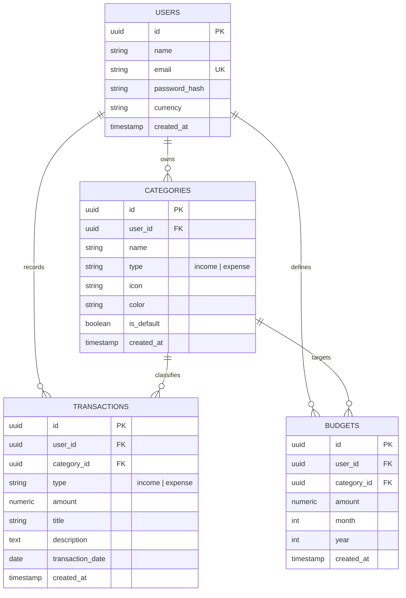

# 💳 FinTrack — Full-Stack Personal Finance & Expense Tracker

> A modern, production-grade personal finance SaaS web application designed for tracking expenses, managing monthly budgets, visualizing cash flow, and achieving financial goals. Built with clean architecture, strict database relationships, and intuitive data visualization.

---

## 📸 Overview & Key Features

* **🔐 Authentication & User Isolation:** Secure registration, login, and JWT-based authentication with Bcrypt password hashing. Each user's data is strictly isolated with composite database constraints and foreign key cascade rules.
* **📊 Interactive Financial Dashboard:**
  * Lifetime Balance, Monthly Income, Monthly Expenses, and Monthly Savings calculations.
  * Real-time savings rate (%) and month-over-month trend indicators.
  * Recharts 6-month interactive Area Chart for cash flow comparison.
  * Category expense breakdown Donut Chart with customizable legends and tooltips.
  * Monthly budget progress meters and recent transactions widget.
* **💸 Transactions Engine:**
  * Full CRUD for Income and Expense transactions.
  * Real-time search by title and description.
  * Multi-dimensional filtering by type, category, and date range.
  * Dynamic sorting by date, amount, or title.
  * Client and server-side pagination with seamless state updates.
* **🎯 Monthly Category Budgets:**
  * Set category-specific monthly spending limits.
  * Real-time calculation of spent amount, remaining balance, and utilization percentage.
  * Dynamic threshold color transitions (Green → Amber → Red) and over-budget alerts.
  * Month/year time-travel selector.
* **🏷️ Customizable Categories:**
  * Pre-seeded default categories on registration (Food & Dining, Transport, Shopping, Housing, Bills, Salary, Freelancing, etc.).
  * Create custom categories with custom icons (from 30+ Lucide icons) and tailored color swatches.
  * Referential integrity checks preventing accidental deletion of categories linked to active transactions.
* **📈 Annual Reports & Analytics:**
  * 12-month annual cash flow comparison bar chart.
  * Total annual income, total annual expenses, annual net savings, and average monthly burn rate.
  * Annual category expenditure distribution breakdown table.
* **👤 User Profile & Multi-Currency Support:**
  * Support for 8 major currencies (₹ INR, $ USD, € EUR, £ GBP, CA$ CAD, AU$ AUD, S$ SGD, ¥ JPY).
  * Profile management and secure password change workflows.

---

## 🛠️ Technology Stack

| Layer | Technology | Rationale |
| :--- | :--- | :--- |
| **Frontend** | **React 18 + TypeScript + Vite** | Fast build tooling, strict type safety for financial data models, and component reusability. |
| **Styling** | **Tailwind CSS + Lucide Icons** | Bespoke SaaS design system with custom slate surfaces, brand emerald accents, and responsive drawers. |
| **Charts** | **Recharts** | Declarative SVG-based React charts (Area, Bar, Pie/Donut) with smooth animations and responsive containers. |
| **Backend** | **Python 3 + Flask + Blueprints** | Lightweight, modular REST API architecture with clear separation between controllers, services, and models. |
| **Database & ORM** | **PostgreSQL + SQLAlchemy 2.0** | Relational integrity, foreign key cascades, unique period constraints, and Supabase compatibility. |
| **Auth & Security** | **PyJWT + Bcrypt** | Stateless token authentication with `@token_required` decorators and secure password salting. |
| **Testing** | **Pytest + Pytest-Flask** | Automated integration tests for authentication, category CRUD, transaction aggregations, and budget calculations. |

---

## 🏛️ System Architecture

```
                               ┌────────────────────────────────┐
                               │   React + TypeScript Frontend  │
                               │  (Vite, Tailwind, Recharts)    │
                               └──────────────┬─────────────────┘
                                              │  REST API / JWT
                                              ▼
                               ┌────────────────────────────────┐
                               │       Flask Backend API        │
                               │   (Blueprints, Services, ORM)  │
                               └──────────────┬─────────────────┘
                                              │  SQLAlchemy 2.0
                                              ▼
                               ┌────────────────────────────────┐
                               │     PostgreSQL / Supabase      │
                               │  (Multi-tenant DB, Relations)  │
                               └────────────────────────────────┘
```

---

## 🗄️ Database Schema & Entity Relationships



---

## 🔌 REST API Specification

### Authentication
* `POST /api/auth/register` — Create new user account & seed default categories.
* `POST /api/auth/login` — Authenticate and obtain JWT bearer token.
* `GET /api/auth/me` — Fetch authenticated user details.
* `PUT /api/auth/profile` — Update name, currency, or password.

### Transactions
* `GET /api/transactions` — Query transactions with filtering (`type`, `category_id`, `start_date`, `end_date`, `search`), sorting, and pagination.
* `POST /api/transactions` — Create a new income or expense transaction.
* `GET /api/transactions/:id` — Get single transaction details.
* `PUT /api/transactions/:id` — Update transaction fields.
* `DELETE /api/transactions/:id` — Delete a transaction.

### Categories
* `GET /api/categories` — List all categories for authenticated user (supports `?type=income|expense`).
* `POST /api/categories` — Create custom category with icon and color.
* `PUT /api/categories/:id` — Update category properties.
* `DELETE /api/categories/:id` — Safely delete category (validates no linked transactions exist).

### Budgets
* `GET /api/budgets` — Fetch budgets for month and year with computed `spent_amount`, `remaining_amount`, and `percentage_used`.
* `POST /api/budgets` — Upsert monthly budget limit for a category.
* `DELETE /api/budgets/:id` — Remove budget limit.

### Dashboard & Analytics
* `GET /api/dashboard/summary` — Lifetime balance, current month income, expense, savings rate, and recent transactions.
* `GET /api/dashboard/monthly-trends` — 6-month aggregate income vs expense trend for charts.
* `GET /api/dashboard/category-breakdown` — Category spending distribution for donut chart.
* `GET /api/reports/analytics` — 12-month annual cash flow and category breakdown.

---

## 🚀 Local Development Setup

### Prerequisites
* **Node.js**: v18+ (Tested on v22)
* **Python**: 3.10+ (Tested on 3.13)
* **npm** and **pip**

### 1. Backend Setup
```bash
cd backend

# Create and activate virtual environment
python -m venv venv
# Windows:
.\venv\Scripts\activate
# Mac/Linux:
source venv/bin/activate

# Install dependencies
pip install -r requirements.txt

# Run backend test suite
python -m pytest -v

# Start development server
python run.py
```
Backend API will be running on `http://127.0.0.1:5000`.

### 2. Frontend Setup
```bash
cd frontend

# Install packages
npm install

# Start Vite development server
npm run dev
```
Frontend web application will be accessible at `http://127.0.0.1:5173`.

---

## 🌐 Production Deployment Guide

### Database (Supabase PostgreSQL)
1. Create a free project on [Supabase](https://supabase.com).
2. Copy the Connection String URI from **Project Settings > Database**.
3. Set `DATABASE_URL` in your backend environment variables.

### Backend (Render / Railway)
1. Create a **Web Service** on [Render](https://render.com) pointing to the `backend/` folder.
2. Build Command: `pip install -r requirements.txt`
3. Start Command: `gunicorn run:app`
4. Set Environment Variables:
   * `DATABASE_URL` = Your Supabase Postgres URL
   * `SECRET_KEY` = High entropy secret string
   * `JWT_SECRET_KEY` = High entropy JWT secret
   * `CORS_ORIGIN` = `https://your-frontend.vercel.app`

### Frontend (Vercel)
1. Import repository on [Vercel](https://vercel.com).
2. Root Directory: `frontend`
3. Framework Preset: `Vite`
4. Environment Variable:
   * `VITE_API_BASE_URL` = `https://your-backend.onrender.com/api`
5. Deploy!

---

## 💡 Engineering Interview Talking Points

1. **Clean Separation of Concerns:** Business logic and mathematical calculations (e.g. savings rates, budget utilization percentages, month-over-month percentage changes) are strictly computed on the backend service layer, keeping the frontend lightweight and focused solely on UI state and presentation.
2. **Multi-Tenant User Isolation:** Every entity (`Category`, `Transaction`, `Budget`) is scoped to `user_id` with foreign keys and cascade rules. Database queries always filter by `current_user_id` extracted from validated JWT claims.
3. **Optimistic & Reactive UI Updates:** When transactions or budgets are modified, custom event dispatchers trigger background recalculations across dependent dashboard charts and summary cards without requiring full page reloads.
4. **Resilient Category Management:** When a new user registers, system-standard default categories are seeded directly into their account, allowing users to freely edit or re-color them without affecting other users or global database templates.
