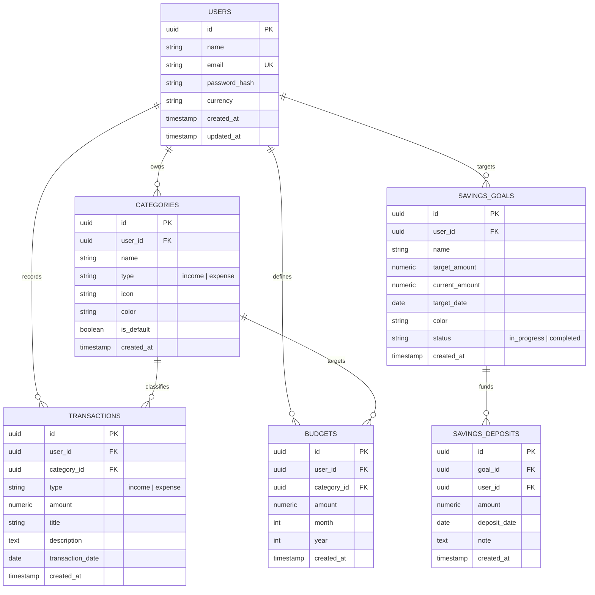

# 💳 FinTrack — Full-Stack Personal Finance & Expense Tracker

[](https://fin-track-expense-tracker-beta.vercel.app/)
[](https://fintrack-expense-tracker-h09y.onrender.com/api/health)
[](https://supabase.com)
[](https://react.dev)
[](https://flask.palletsprojects.com/)
[](LICENSE)

> 🚀 **Live Production Web Application:** [https://fin-track-expense-tracker-beta.vercel.app/](https://fin-track-expense-tracker-beta.vercel.app/)  
> ⚡ **Live Production API (Health Check):** [https://fintrack-expense-tracker-h09y.onrender.com/api/health](https://fintrack-expense-tracker-h09y.onrender.com/api/health)

A modern, production-grade personal finance SaaS web application designed for tracking expenses, managing monthly category budgets, visualizing cash flow, setting dedicated savings targets, and achieving financial independence. Built with clean architecture, strict multi-tenant database isolation, and intuitive data visualizations.

---

## 📸 Overview & Key Features

* **🔐 Authentication & Security:**
  * Secure registration, login, and JWT-based authentication with Bcrypt password hashing.
  * **1-Click Portfolio Demo Login:** Instant guest evaluation without manual signup.
  * **Forgot & Reset Password Workflow:** Self-service password reset with validation.
  * User data isolation using strict composite database foreign keys and `@token_required` decorators.
* **📊 Interactive Financial Dashboard:**
  * Lifetime Balance, Monthly Income, Monthly Expenses, and Dedicated Total Savings KPIs.
  * Real-time savings rate (%) and month-over-month trend indicators.
  * Recharts 6-month interactive Area Chart for cash flow trend analysis.
  * **Classic Solid Pie Chart** for category spending breakdown with trigonometric percentage slice callout labels.
  * Monthly budget progress meters and recent transactions widget.
* **💸 Transactions Engine:**
  * Full CRUD for Income and Expense transactions with floating-point drift prevention (`Numeric(12, 2)`).
  * Real-time search across transaction titles and descriptions.
  * Multi-dimensional filtering by type, category, and date range.
  * Dynamic sorting by date, amount, or title with responsive pagination.
* **🏦 Savings Goals & Deposits:**
  * Create dedicated financial targets (e.g., Emergency Fund, Vacation, New Car) with target amounts and deadlines.
  * Log iterative deposits with auto-calculating progress bars, remaining target amounts, and completion status.
* **🎯 Monthly Category Budgets:**
  * Set category-specific monthly spending limits with month/year time-travel navigation.
  * Real-time calculation of spent amount, remaining balance, and utilization percentages.
  * Dynamic threshold color transitions (Green → Amber → Red) and over-budget warnings.
* **🏷️ Customizable Categories:**
  * Pre-seeded default categories on registration (Food & Dining, Transport, Shopping, Housing, Bills, Salary, Freelance, etc.).
  * Create custom categories with custom icons (from 30+ Lucide icons) and curated color swatches.
  * Referential integrity checks preventing accidental deletion of categories linked to active transactions.
* **📈 Annual Reports & Analytics:**
  * 12-month annual cash flow comparison bar chart.
  * Total annual income, total annual expenses, annual net savings, and average monthly burn rate.
  * Annual category expenditure distribution breakdown table.
* **👤 User Profile & Multi-Currency Support:**
  * Support for 8 major currencies (₹ INR, $ USD, € EUR, £ GBP, CA$ CAD, AU$ AUD, S$ SGD, ¥ JPY).
  * Profile management with editable Name, Email (with duplicate protection), and secure password updates.

---

## 🛠️ Technology Stack

| Layer | Technology | Rationale |
| :--- | :--- | :--- |
| **Frontend** | **React 18 + TypeScript + Vite** | Fast build tooling, strict type safety for financial data models, and component reusability. |
| **Styling** | **Tailwind CSS + Lucide Icons** | Bespoke SaaS design system with custom slate surfaces, brand emerald accents, and responsive drawers. |
| **Charts** | **Recharts** | Declarative SVG-based React charts (Area, Bar, Solid Pie) with smooth animations and responsive containers. |
| **Backend** | **Python 3 + Flask + Blueprints** | Lightweight, modular REST API architecture with clean separation of controllers, services, and models. |
| **Database & ORM** | **PostgreSQL (Supabase) + SQLAlchemy 2.0** | Relational integrity, foreign key cascades, connection pooling (Supavisor IPv4), and psycopg 3. |
| **Auth & Security** | **PyJWT + Bcrypt** | Stateless token authentication with `@token_required` decorators and secure password salting. |
| **Testing** | **Pytest + Pytest-Flask** | Automated integration tests for authentication, category CRUD, transaction aggregations, and budget calculations. |
| **Deployment** | **Vercel (Frontend) + Render (Backend)** | Continuous deployment directly linked to GitHub repository branches with zero-downtime builds. |

---

## 🏛️ System Architecture

```
                  ┌───────────────────────────────┐
                  │        Vercel (Frontend)      │
                  │  React 18 + TypeScript + Vite │
                  └──────────────┬────────────────┘
                                 │ HTTPS (REST API / Bearer JWT)
                                 ▼
                  ┌───────────────────────────────┐
                  │        Render (Backend)       │
                  │ Flask + Gunicorn + Blueprints │
                  └──────────────┬────────────────┘
                                 │ SQLAlchemy 2.0 / IPv4 Connection Pooler (Port 6543)
                                 ▼
                  ┌───────────────────────────────┐
                  │      Supabase (Database)      │
                  │      PostgreSQL Database      │
                  └───────────────────────────────┘
```

---

## 🗄️ Database Schema & Entity Relationships



---

## 🔌 REST API Specification

### Authentication & User
* `POST /api/auth/register` — Create new user account & auto-seed default categories.
* `POST /api/auth/login` — Authenticate and obtain JWT bearer token.
* `POST /api/auth/reset-password` — Self-service password reset.
* `GET /api/auth/me` — Fetch authenticated user details.
* `PUT /api/auth/profile` — Update name, email, currency, or password.

### Transactions
* `GET /api/transactions` — Query transactions with multi-filtering (`type`, `category_id`, `start_date`, `end_date`, `search`), sorting, and pagination.
* `POST /api/transactions` — Create a new income or expense transaction.
* `GET /api/transactions/:id` — Get single transaction details.
* `PUT /api/transactions/:id` — Update transaction fields.
* `DELETE /api/transactions/:id` — Delete a transaction.

### Savings Goals & Deposits
* `GET /api/savings` — List all savings goals with aggregated deposits and completion percentages.
* `POST /api/savings` — Create a new savings goal.
* `PUT /api/savings/:id` — Update savings goal target or deadline.
* `DELETE /api/savings/:id` — Delete savings goal and its deposit records.
* `POST /api/savings/:id/deposits` — Record a savings deposit.

### Categories
* `GET /api/categories` — List all categories for authenticated user (supports `?type=income|expense`).
* `POST /api/categories` — Create custom category with icon and color.
* `PUT /api/categories/:id` — Update category properties.
* `DELETE /api/categories/:id` — Safely delete category (validates no linked transactions exist).

### Budgets
* `GET /api/budgets` — Fetch budgets for month and year with computed `spent_amount`, `remaining_amount`, and `percentage_used`.
* `POST /api/budgets` — Upsert monthly budget limit for a category.
* `DELETE /api/budgets/:id` — Remove budget limit.

### Dashboard & Analytics
* `GET /api/dashboard/summary` — Lifetime balance, monthly income, expense, savings KPIs, and recent transactions.
* `GET /api/dashboard/monthly-trends` — 6-month aggregate income vs expense trends.
* `GET /api/dashboard/category-breakdown` — Category spending distribution for solid pie chart.
* `GET /api/reports/analytics` — 12-month annual cash flow and category breakdown.

---

## 🚀 Local Development Setup

### Prerequisites
* **Node.js**: v18+ (Tested on v22)
* **Python**: 3.10+ (Tested on 3.13)
* **npm** and **pip**

### 1. Backend Setup
```bash
cd backend

# Create and activate virtual environment
python -m venv venv
# Windows:
.\venv\Scripts\activate
# Mac/Linux:
source venv/bin/activate

# Install dependencies
pip install -r requirements.txt

# Run backend test suite
python -m pytest -v

# Start development server
python run.py
```
Backend API will run on `http://127.0.0.1:5000`.

### 2. Frontend Setup
```bash
cd frontend

# Install packages
npm install

# Start Vite development server
npm run dev
```
Frontend web application will run on `http://127.0.0.1:5173`.

---

## 💡 Engineering Interview Talking Points

1. **Decoupled Production Architecture:** Independent frontend client (Vercel) communicating over JWT-authenticated REST APIs to a containerized Python/Flask backend (Render) connected to cloud PostgreSQL (Supabase).
2. **Clean Separation of Concerns:** Mathematical computations (savings rates, budget utilization percentages, month-over-month trend indicators) are strictly computed on the backend service layer, keeping the frontend lightweight and focused solely on reactive UI state.
3. **Multi-Tenant User Isolation:** Every entity is scoped to `user_id` with foreign keys and cascade rules. Database queries strictly filter by `current_user_id` extracted from validated JWT claims.
4. **Precision Financial Math:** Eliminates IEEE-754 floating-point drift by using database `Numeric(12, 2)` types and Python decimal conversions for currency calculations.
5. **Resilient Category Management:** When a new user registers, system-standard default categories are seeded directly into their account, allowing users to freely edit or re-color them without affecting other users or global database templates.
