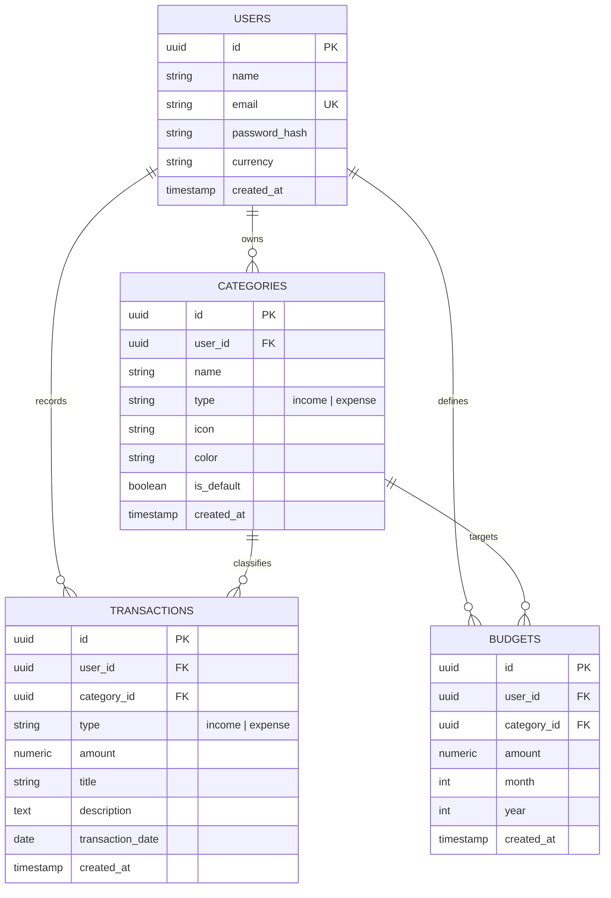
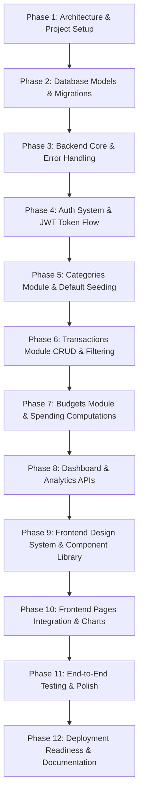

# Full-Stack Expense & Finance Tracker — Architectural Blueprint & Implementation Plan

A production-style personal finance SaaS web application built with **React + TypeScript + Vite + Tailwind CSS** on the frontend, **Python + Flask + SQLAlchemy** on the backend, and **PostgreSQL (Supabase-compatible)** for persistence.

---

## User Review Required

> [!IMPORTANT]
> **Authentication Token Storage Strategy:**
> We will use **JWT stored in HTTP-only, SameSite cookies** (with a fallback/support for standard Bearer auth header in local dev/CORS setups) for maximum security against XSS.
>
> **Default Categories Seeding Strategy:**
> System-defined default categories (Food, Rent, Salary, etc.) can either be:
> 1. Seeded into each user's account upon registration (`user_id = <user_id>`, fully editable/deletable by that user), OR
> 2. Global defaults (`user_id IS NULL`) plus user-created custom categories.
>
> *Recommendation:* **Per-user seeded defaults upon registration** (Option 1). This gives each user complete freedom to rename, re-color, or delete categories without complex global overrides or breaking transaction relationships.

---

## 1. Important Technical Decisions & Trade-Offs

| Decision Area | Chosen Technology / Approach | Why It Was Chosen | Alternatives Considered & Rejected |
| :--- | :--- | :--- | :--- |
| **Backend Framework** | **Flask (with Blueprints & Flask-SQLAlchemy)** | Minimal, explicit, easy to explain in interviews. Flask lets us showcase clean modular architecture (controllers, services, models) without the magic or heavy footprint of Django. | **FastAPI:** Great for async, but Flask is classic, standard, and synchronous DB drivers are simpler for CRUD apps.<br>**Django:** Too heavyweight, built-in ORM/admin obscures core architecture for a focused portfolio project. |
| **Database & ORM** | **PostgreSQL + SQLAlchemy 2.0 + Alembic** | Industry-standard relational DB. SQLAlchemy 2.0 provides type-safe ORM models, declarative mappings, and migration workflows with Alembic. Works seamlessly locally and on Supabase/Render. | **Raw `psycopg2`:** Too error-prone and tedious for multi-table relationships.<br>**MongoDB:** Relational schema fits financial transactions, categories, and budgets far better. |
| **Authentication Flow** | **JWT with `flask-jwt-extended` / `PyJWT` + Bcrypt** | Stateless authentication, standard for modern REST APIs. Tokens contain `user_id` claims, validated via a lightweight `@jwt_required` / auth middleware decorator. | **Flask-Login / Session cookies:** Harder to decouple when frontend is hosted separately on Vercel.<br>**OAuth-only (Google):** Hides backend password hashing and auth validation skills in interview discussions. |
| **Frontend Framework & Tooling** | **React 18 + TypeScript + Vite** | Blazing fast build and HMR, strict type safety for financial data models, standard industry stack for modern SPAs. | **Next.js:** Unnecessary SSR complexity for a strictly authenticated dashboard application.<br>**CRA (Create React App):** Deprecated and slow. |
| **Styling & Design System** | **Tailwind CSS + Lucide Icons** | Utility-first styling delivers bespoke, polished SaaS aesthetic without heavy third-party UI library bloat. Allows full control over color tokens, transitions, and responsive layouts. | **Material UI / Ant Design:** Generic "template" look that hurts portfolio uniqueness.<br>**Vanilla CSS from scratch:** Slower velocity for responsive tables, modals, and grids. |
| **Data Visualization** | **Recharts** | Declarative React SVG-based chart library that renders crisp, animated, responsive charts (Area, Bar, Donut/Pie) and integrates cleanly with Tailwind color palettes. | **Chart.js:** Imperative canvas-based, less idiomatic in React.<br>**D3.js:** Overkill for standard dashboard charts. |
| **State & API Management** | **Custom Axios Client + React Context + Custom Hooks** | Clean, transparent data-fetching hooks (`useTransactions`, `useBudgets`, `useAuth`) without excessive boilerplate. Easy to follow during code reviews and interviews. | **Redux Toolkit:** Over-engineered for an app of this scope.<br>**TanStack Query:** Excellent, but custom hooks with clean loading/error states showcase foundational React skills clearly. |

---

## 2. Recommended Folder Structure

A clean, modular monorepo containing `backend/` and `frontend/`:

```
expense-tracker/
├── backend/
│   ├── app/
│   │   ├── __init__.py              # App factory (create_app), extension initialization
│   │   ├── config.py                # Environment configurations (Dev, Test, Prod)
│   │   ├── models/
│   │   │   ├── __init__.py          # Export all models
│   │   │   ├── user.py              # User model + password hashing methods
│   │   │   ├── category.py          # Category model (income/expense, color, icon)
│   │   │   ├── transaction.py       # Transaction model
│   │   │   └── budget.py            # Budget model (monthly limits per category)
│   │   ├── schemas/
│   │   │   ├── __init__.py
│   │   │   ├── auth_schema.py       # Marshmallow / Pydantic / dataclass request validation
│   │   │   ├── transaction_schema.py
│   │   │   ├── category_schema.py
│   │   │   └── budget_schema.py
│   │   ├── routes/
│   │   │   ├── __init__.py
│   │   │   ├── auth_routes.py       # /api/auth/*
│   │   │   ├── transaction_routes.py# /api/transactions/*
│   │   │   ├── category_routes.py   # /api/categories/*
│   │   │   ├── budget_routes.py     # /api/budgets/*
│   │   │   └── dashboard_routes.py  # /api/dashboard/* (summary, trends, category breakdown)
│   │   ├── services/
│   │   │   ├── __init__.py
│   │   │   ├── auth_service.py      # Registration, auth verification, default category seeding
│   │   │   ├── transaction_service.py # Filtering, pagination, sorting, aggregation
│   │   │   ├── budget_service.py    # Budget calculations, % spent, threshold alerts
│   │   │   └── analytics_service.py # Income vs expense, category aggregates, monthly trends
│   │   └── utils/
│   │       ├── __init__.py
│   │       ├── auth_decorator.py    # @token_required / @jwt_required decorator
│   │       ├── error_handlers.py    # Global HTTP error handler & standardized response helper
│   │       └── constants.py         # Default categories, icons, colors
│   ├── migrations/                  # Alembic DB migration files
│   ├── tests/
│   │   ├── conftest.py              # Pytest fixtures, test DB setup, auth client
│   │   ├── test_auth.py
│   │   ├── test_transactions.py
│   │   ├── test_budgets.py
│   │   └── test_dashboard.py
│   ├── .env.example
│   ├── requirements.txt
│   ├── run.py                       # WSGI entry point
│   └── README.md
│
├── frontend/
│   ├── public/
│   │   ├── favicon.svg
│   │   └── robots.txt
│   ├── src/
│   │   ├── assets/                  # Logos, illustrations
│   │   ├── components/
│   │   │   ├── common/              # Base UI design system
│   │   │   │   ├── Button.tsx
│   │   │   │   ├── Input.tsx
│   │   │   │   ├── Select.tsx
│   │   │   │   ├── Modal.tsx
│   │   │   │   ├── Card.tsx
│   │   │   │   ├── Badge.tsx
│   │   │   │   ├── ProgressBar.tsx
│   │   │   │   ├── StatCard.tsx
│   │   │   │   ├── EmptyState.tsx
│   │   │   │   ├── LoadingSpinner.tsx
│   │   │   │   ├── SkeletonLoader.tsx
│   │   │   │   ├── ConfirmDialog.tsx
│   │   │   │   └── Toast.tsx
│   │   │   ├── layout/
│   │   │   │   ├── AppLayout.tsx    # Sidebar + Header + Page container
│   │   │   │   ├── Sidebar.tsx      # Collapsible / responsive mobile drawer
│   │   │   │   ├── Header.tsx       # Profile badge, quick-add CTA, breadcrumbs
│   │   │   │   └── ProtectedRoute.tsx # Auth route guard
│   │   │   ├── transactions/
│   │   │   │   ├── TransactionTable.tsx
│   │   │   │   ├── TransactionFilters.tsx
│   │   │   │   ├── TransactionModal.tsx
│   │   │   │   └── TransactionRow.tsx
│   │   │   ├── budgets/
│   │   │   │   ├── BudgetCard.tsx
│   │   │   │   ├── BudgetModal.tsx
│   │   │   │   └── BudgetProgressList.tsx
│   │   │   ├── categories/
│   │   │   │   ├── CategoryCard.tsx
│   │   │   │   └── CategoryModal.tsx
│   │   │   ├── dashboard/
│   │   │   │   ├── IncomeExpenseChart.tsx
│   │   │   │   ├── CategoryPieChart.tsx
│   │   │   │   ├── BudgetOverviewCard.tsx
│   │   │   │   └── RecentTransactionsCard.tsx
│   │   │   └── reports/
│   │   │       ├── MonthlyTrendChart.tsx
│   │   │       ├── CategoryBreakdownTable.tsx
│   │   │       └── SavingsRateCard.tsx
│   │   ├── context/
│   │   │   ├── AuthContext.tsx      # Auth state (user, login, logout, token refresh)
│   │   │   ├── CurrencyContext.tsx  # Format currency (₹ INR, $ USD, etc.)
│   │   │   └── ToastContext.tsx     # Toast notification dispatch
│   │   ├── hooks/
│   │   │   ├── useTransactions.ts
│   │   │   ├── useBudgets.ts
│   │   │   ├── useCategories.ts
│   │   │   └── useDashboard.ts
│   │   ├── pages/
│   │   │   ├── Login.tsx
│   │   │   ├── Register.tsx
│   │   │   ├── Dashboard.tsx
│   │   │   ├── Transactions.tsx
│   │   │   ├── Budgets.tsx
│   │   │   ├── Categories.tsx
│   │   │   ├── Reports.tsx
│   │   │   ├── Profile.tsx
│   │   │   └── NotFound.tsx
│   │   ├── services/
│   │   │   ├── api.ts               # Axios instance with interceptors & auth injection
│   │   │   ├── authApi.ts
│   │   │   ├── transactionApi.ts
│   │   │   ├── categoryApi.ts
│   │   │   ├── budgetApi.ts
│   │   │   └── dashboardApi.ts
│   │   ├── types/                   # TypeScript interfaces & DTOs
│   │   │   ├── index.ts
│   │   │   ├── auth.ts
│   │   │   ├── transaction.ts
│   │   │   ├── category.ts
│   │   │   ├── budget.ts
│   │   │   └── analytics.ts
│   │   ├── utils/
│   │   │   ├── formatters.ts        # Currency formatting, date formatters (date-fns / Intl)
│   │   │   ├── validators.ts        # Form validation helpers
│   │   │   └── constants.ts         # Colors, default category icons
│   │   ├── App.tsx                  # Router setup
│   │   ├── index.css                # Tailwind directives & design tokens
│   │   └── main.tsx                 # React DOM root
│   ├── .env.example
│   ├── package.json
│   ├── tsconfig.json
│   ├── vite.config.ts
│   └── tailwind.config.js
│
├── .gitignore
├── LICENSE
└── README.md                        # High quality portfolio documentation with demo GIF & API specs
```

---

## 3. Detailed Database Schema & Entity Relationships

### PostgreSQL DDL & Constraints

```sql
-- 1. USERS TABLE
CREATE TABLE users (
    id UUID PRIMARY KEY DEFAULT gen_random_uuid(),
    name VARCHAR(100) NOT NULL,
    email VARCHAR(255) UNIQUE NOT NULL,
    password_hash VARCHAR(255) NOT NULL,
    currency VARCHAR(10) DEFAULT 'INR',
    created_at TIMESTAMP WITH TIME ZONE DEFAULT CURRENT_TIMESTAMP,
    updated_at TIMESTAMP WITH TIME ZONE DEFAULT CURRENT_TIMESTAMP
);

CREATE INDEX idx_users_email ON users(email);

-- 2. CATEGORIES TABLE
CREATE TABLE categories (
    id UUID PRIMARY KEY DEFAULT gen_random_uuid(),
    user_id UUID NOT NULL REFERENCES users(id) ON DELETE CASCADE,
    name VARCHAR(50) NOT NULL,
    type VARCHAR(10) NOT NULL CHECK (type IN ('income', 'expense')),
    icon VARCHAR(50) DEFAULT 'Tag',
    color VARCHAR(20) DEFAULT '#6366F1',
    is_default BOOLEAN DEFAULT FALSE,
    created_at TIMESTAMP WITH TIME ZONE DEFAULT CURRENT_TIMESTAMP,
    CONSTRAINT uq_user_category_name_type UNIQUE (user_id, name, type)
);

CREATE INDEX idx_categories_user_id ON categories(user_id);
CREATE INDEX idx_categories_type ON categories(type);

-- 3. TRANSACTIONS TABLE
CREATE TABLE transactions (
    id UUID PRIMARY KEY DEFAULT gen_random_uuid(),
    user_id UUID NOT NULL REFERENCES users(id) ON DELETE CASCADE,
    category_id UUID NOT NULL REFERENCES categories(id) ON DELETE RESTRICT,
    type VARCHAR(10) NOT NULL CHECK (type IN ('income', 'expense')),
    amount NUMERIC(12, 2) NOT NULL CHECK (amount > 0),
    title VARCHAR(150) NOT NULL,
    description TEXT,
    transaction_date DATE NOT NULL,
    created_at TIMESTAMP WITH TIME ZONE DEFAULT CURRENT_TIMESTAMP,
    updated_at TIMESTAMP WITH TIME ZONE DEFAULT CURRENT_TIMESTAMP
);

CREATE INDEX idx_transactions_user_id ON transactions(user_id);
CREATE INDEX idx_transactions_user_date ON transactions(user_id, transaction_date DESC);
CREATE INDEX idx_transactions_user_category ON transactions(user_id, category_id);
CREATE INDEX idx_transactions_user_type ON transactions(user_id, type);

-- 4. BUDGETS TABLE
CREATE TABLE budgets (
    id UUID PRIMARY KEY DEFAULT gen_random_uuid(),
    user_id UUID NOT NULL REFERENCES users(id) ON DELETE CASCADE,
    category_id UUID NOT NULL REFERENCES categories(id) ON DELETE CASCADE,
    amount NUMERIC(12, 2) NOT NULL CHECK (amount > 0),
    month SMALLINT NOT NULL CHECK (month BETWEEN 1 AND 12),
    year SMALLINT NOT NULL CHECK (year >= 2020),
    created_at TIMESTAMP WITH TIME ZONE DEFAULT CURRENT_TIMESTAMP,
    updated_at TIMESTAMP WITH TIME ZONE DEFAULT CURRENT_TIMESTAMP,
    CONSTRAINT uq_user_category_month_year UNIQUE (user_id, category_id, month, year)
);

CREATE INDEX idx_budgets_user_period ON budgets(user_id, year, month);
```

### Entity Relationship Diagram (Mermaid)



---

## 4. REST API Specification

All API responses follow a consistent JSON response envelope:
```json
{
  "success": true,
  "data": { ... },
  "message": "Operation successful"
}
```
Or for errors:
```json
{
  "success": false,
  "error": {
    "code": "VALIDATION_ERROR",
    "message": "Transaction amount must be greater than 0",
    "details": { "amount": ["Must be greater than 0"] }
  }
}
```

### Endpoints Table

| Method | Endpoint | Description | Auth Required |
| :--- | :--- | :--- | :--- |
| `POST` | `/api/auth/register` | Register new user + seed default categories | No |
| `POST` | `/api/auth/login` | Login user & return JWT token | No |
| `POST` | `/api/auth/logout` | Clear auth token / session | Yes |
| `GET` | `/api/auth/me` | Get current authenticated user profile | Yes |
| `PUT` | `/api/auth/profile` | Update profile (name, currency, password) | Yes |
| `GET` | `/api/categories` | List user categories (filterable by `type`) | Yes |
| `POST` | `/api/categories` | Create custom category | Yes |
| `PUT` | `/api/categories/:id` | Update category name, color, icon | Yes |
| `DELETE`| `/api/categories/:id` | Delete category (safely checked against transactions) | Yes |
| `GET` | `/api/transactions` | List transactions (search, filter by type/category/date, pagination) | Yes |
| `POST` | `/api/transactions` | Create new transaction | Yes |
| `GET` | `/api/transactions/:id`| Get single transaction detail | Yes |
| `PUT` | `/api/transactions/:id`| Update transaction | Yes |
| `DELETE`| `/api/transactions/:id`| Delete transaction | Yes |
| `GET` | `/api/budgets` | List budgets for month/year with spending & % used | Yes |
| `POST` | `/api/budgets` | Set category budget for specific month/year | Yes |
| `PUT` | `/api/budgets/:id` | Update budget amount | Yes |
| `DELETE`| `/api/budgets/:id` | Delete a budget | Yes |
| `GET` | `/api/dashboard/summary`| Total balance, total income, total expenses, savings rate | Yes |
| `GET` | `/api/dashboard/monthly-trends`| Last 6-12 months income vs expense for Recharts Area/Bar | Yes |
| `GET` | `/api/dashboard/category-breakdown`| Current month expense breakdown by category for PieChart | Yes |
| `GET` | `/api/reports/analytics`| Comprehensive reporting data (cashflow, top spending categories) | Yes |

---

## 5. UI/UX Design Proposal & Color System

### Design Philosophy
A sleek, modern, professional SaaS financial interface inspired by Stripe and Linear. Clean slate backgrounds, soft border contrasts, crisp typography, intuitive status badges, and deliberate accent colors.

### Design System Tokens
- **Backgrounds**: Light mode `bg-slate-50`, Dark-ready `bg-slate-900`/`bg-slate-950`
- **Cards**: `bg-white dark:bg-slate-800 border border-slate-200/80 dark:border-slate-700/80 rounded-2xl shadow-sm`
- **Primary Accent**: Emerald / Indigo gradient (`#10B981` / `#6366F1`)
- **Income Tone**: Emerald Green (`#059669` / `bg-emerald-50 text-emerald-700`)
- **Expense Tone**: Rose / Red (`#E11D48` / `bg-rose-50 text-rose-700`)
- **Budget Warning Tone**: Amber (`#D97706` / `bg-amber-50 text-amber-700`)
- **Typography**: Inter / Outfit via Google Fonts with clear scale (`text-xs` up to `text-3xl font-bold`)

### Page Layout Architecture
- **Desktop**: Fixed left sidebar (Collapsible to icon rail), Top header with search, active date range selector, quick "Add Transaction" CTA button, and user avatar.
- **Mobile/Tablet**: Responsive sliding drawer sidebar with bottom quick-navigation bar.

---

## 6. Development Phases & Implementation Roadmap



### Detailed Phase Breakdown

1. **Phase 1: Project Architecture & Setup**
   - Initialize Git repo, `.gitignore`, monorepo directory layout.
   - Setup Python virtual environment, `requirements.txt` (Flask, Flask-CORS, SQLAlchemy, Psycopg2-binary, PyJWT, Bcrypt, python-dotenv).
   - Setup Vite + React + TypeScript + Tailwind CSS + Lucide React + Recharts + React Router.

2. **Phase 2: Database Schema & Models**
   - Create SQLAlchemy models for `User`, `Category`, `Transaction`, and `Budget`.
   - Setup database connection with local PostgreSQL / SQLite fallback for quick testing / Supabase integration.

3. **Phase 3: Backend Foundation & Utilities**
   - Application factory pattern `create_app()`.
   - Standardized JSON response utilities and global error handlers.
   - Auth decorator `@token_required`.

4. **Phase 4: Authentication System**
   - Implement `/api/auth/register`, `/api/auth/login`, `/api/auth/me`.
   - Automatic seeding of default categories on new user registration.
   - Password hashing with Bcrypt, JWT token issuance and verification.

5. **Phase 5: Category Management**
   - Full CRUD for categories (`/api/categories`).
   - Validate duplicate category names per user. Prevent deletion if transactions are linked.

6. **Phase 6: Transaction Engine**
   - Full CRUD for transactions (`/api/transactions`).
   - Query filters: `type`, `category_id`, `start_date`, `end_date`, `search` (in title/description), `sort_by`, `page`, `limit`.

7. **Phase 7: Budgeting Engine**
   - CRUD for monthly budgets (`/api/budgets`).
   - Computed fields: `spent_amount`, `remaining_amount`, `percentage_used`, `is_exceeded`.

8. **Phase 8: Dashboard & Analytics Aggregations**
   - `/api/dashboard/summary`: Lifetime & current month income, expense, balance, savings rate.
   - `/api/dashboard/monthly-trends`: 6-month aggregate income vs expense.
   - `/api/dashboard/category-breakdown`: Expense by category with percentages.

9. **Phase 9: Frontend Design System & Core UI Components**
   - Build reusable atoms: `Button`, `Input`, `Select`, `Modal`, `Card`, `Badge`, `ProgressBar`, `StatCard`, `EmptyState`, `Toast`.
   - Build layout: `Sidebar`, `Header`, `AppLayout`, `ProtectedRoute`.

10. **Phase 10: Page Integration & Visual Analytics**
    - Connect Auth pages (`Login`, `Register`).
    - Build `Dashboard` with summary StatCards, Recharts Income vs Expense, Category Donut, Budget Bars, Recent Transactions.
    - Build `Transactions` page with advanced filtering, search, pagination, Add/Edit modal.
    - Build `Budgets` page with visual progress bars, over-budget indicators, Add/Edit modal.
    - Build `Categories` page with custom color pickers and icon selectors.
    - Build `Reports` page with monthly cash flow trends and category distribution.
    - Build `Profile` page for updating user details and currency symbol.

11. **Phase 11: Validation, Testing & UI Polish**
    - Ensure responsive design across mobile, tablet, and desktop.
    - Comprehensive backend unit/integration tests with `pytest`.
    - Loading skeletons, empty states, error toasts, and form validation.

12. **Phase 12: Deployment Readiness & Portfolio Showcase**
    - Create clean `.env.example` files for both frontend and backend.
    - Prepare Render/Railway deployment configuration (Procfile / WSGI) and Vercel `vercel.json`.
    - Write a developer-ready README with architecture diagram, API documentation, and interview discussion talking points.

---

## 7. Verification Plan

### Automated Testing
- Backend unit & integration tests using `pytest` for:
  - Auth registration, login, token validation, user data isolation
  - Category CRUD and protection against deleting categories in active use
  - Transaction CRUD, search, and filtering algorithms
  - Budget calculations (spent, remaining, percentage, over-budget flags)
  - Dashboard aggregate computations

### Manual & Visual Verification
- Browser testing:
  - Verify complete authentication flow (Register -> Auto Login -> Dashboard -> Logout)
  - Add sample income and expenses, verify instant recalculation of total balance and charts
  - Set a budget, add an expense exceeding the budget, and verify alert styling
  - Test responsiveness on mobile viewports (collapsible drawer, compact tables, touch-friendly inputs)
